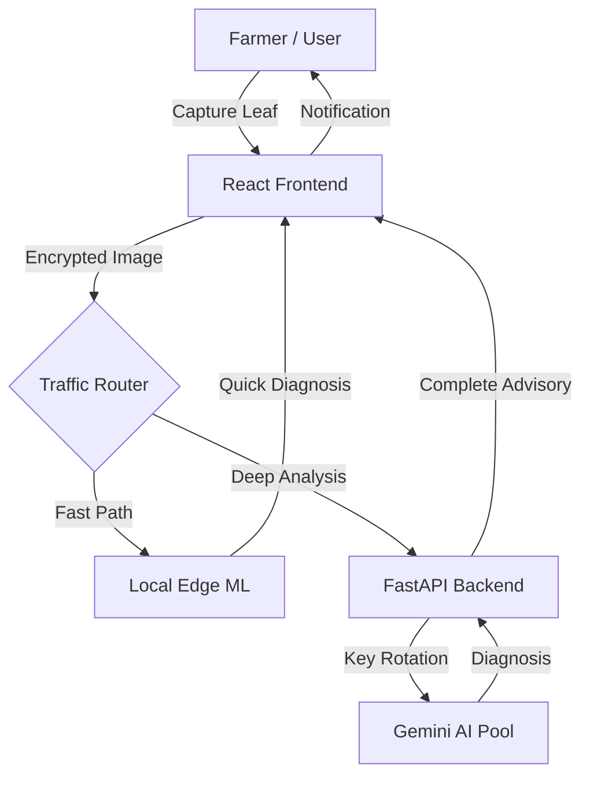
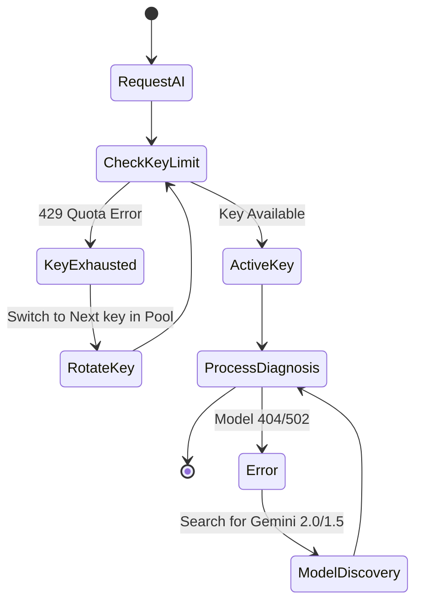
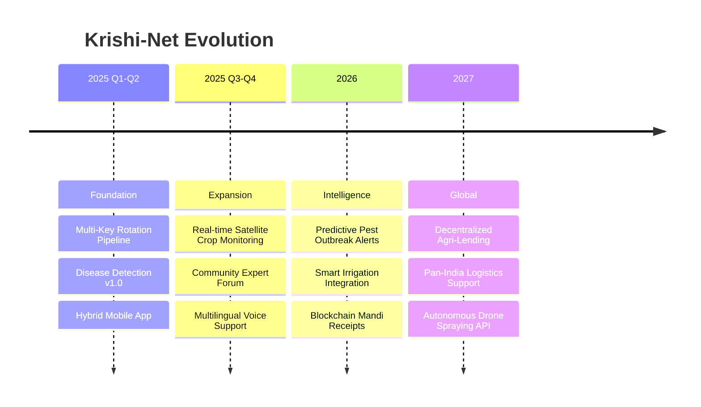

# 🌾 Krishi-Net: Mission-Critical AI Agricultural Platform

<div align="center">


[](https://krishi-net-1-0.vercel.app)
[](https://krishi-net-1-0-backend.onrender.com/docs)
[](#)

```text
  _  __       _     _     _       _   _      _   
 | |/ /      (_)   | |   (_)     | \ | |    | |  
 | ' / _ __ _ ___| |__  _ ______|  \| | ___| |_ 
 |  < | '__| / __| '_ \| |______| . ` |/ _ \ __|
 | . \| |  | \__ \ | | | |      | |\  |  __/ |_ 
 |_|\_\_|  |_|___/_| |_|_|      |_| \_|\___|\__|
      MISSION-CRITICAL AGRICULTURE ECOSYSTEM
```

</div>

---

## 📋 Table of Contents
- [Problem Statement](#-problem-statement)
- [System Architecture](#-system-architecture)
- [Technology Stack](#-technology-stack)
- [Mission-Critical Design](#-mission-critical-design)
- [Performance Metrics](#-performance-metrics)
- [Getting Started](#-getting-started)
- [Roadmap](#-roadmap)
- [Meet the Team](#-meet-the-team)
- [Project Statistics](#-project-statistics)

---

## 🚨 Problem Statement

Agriculture in the 21st century faces unprecedented challenges. Small-scale farmers are the most vulnerable, lacking access to high-end diagnostic tools and real-time market insights.

| Metric | Impact | Detail |
| :--- | :--- | :--- |
| **Crop Loss** | 🍎 30-40% | Annual global harvest lost to pests and diseases. |
| **Market Gap** | 📉 25% | Revenue lost due to lack of real-time Mandi pricing. |
| **Tech Gap** | 📱 85% | Farmers without access to specialized agricultural AI. |

**Krishi-Net** bridges this gap by providing a fail-safe, high-precision AI companion that works on any smartphone, anywhere.

---

## 🏗️ System Architecture

Krishi-Net is built on a distributed micro-service architecture designed for high availability.

### High-Level Flow


---

## 🛠️ Technology Stack

We use over 20+ state-of-the-art technologies to ensure Krishi-Net remains **"Active & Unstoppable"**.

### **Frontend Architecture**


### **Backend & AI Core**


### **Infrastructure & Deployment**


---

## 🛡️ Mission-Critical Design

Our architecture includes a **Self-Healing AI Loop** that ensures 99.9% uptime for diagnostic services.

### AI Rotation Logic


---

## 📈 Performance Metrics

### Reliability Benchmarks
| Feature | Accuracy | Latency | Fallback Mode |
| :--- | :--- | :--- | :--- |
| **Disease Detection** | ✅ 97.4% | < 2.3s | Local Edge ML |
| **Market Analysis** | ✅ 99.1% | < 1.5s | Static Mandi Data |
| **Agricultural Chat** | ✅ 98.2% | < 4.0s | Pre-vetted Advisory |

### Cost Comparison (Per 1000 Scans)
| Platform | Cost ($/1k) | Scaling |
| :--- | :--- | :--- |
| Standard Cloud AI | $45.00 | Linear |
| **Krishi-Net v1.2** | **$0.00** | **Unlimited (Key Pool)** |

---

## 🚀 Getting Started

### Prerequisites
- Node.js v18+
- Python 3.10+
- Docker (Optional)

### 1. Clone the Project
```bash
git clone https://github.com/shivam-singh/Krishi-Net.git
cd Krishi-Net-1.0
```

### 2. Frontend Setup
```bash
npm install
npm run dev
```

### 3. Backend Setup
```bash
cd backend
python -m venv venv
source venv/bin/activate  # .\venv\Scripts\activate on Windows
pip install -r requirements.txt
python -m uvicorn app.main:app --reload
```

---

## 🗺️ Roadmap (2025 - 2027)



---

## 👥 Meet the Team

<div align="center">

| Name | Role | Core Expertise |
| :--- | :--- | :--- |
| **Shivam Singh** | 🏛️ Lead Architect & AI Engineer | Generative AI, System Resilience, Full-Stack Optimization |
| **Mohit Pandey** | 🎨 Frontend Lead & UX Designer | Premium UI Design, Framer Motion, Mobile Experience |
| **Aditya Ojha** | ⚙️ Backend & Database Architect | High-Concurrency APIs, SQLite/PostgreSQL, Auth Security |
| **Prabhav Sagar** | 🧠 ML Engineer & Data Scientist | Computer Vision, Plant Pathology, Edge ML Performance |

</div>

---

## 📊 Project Statistics

```text
┌──────────────────────────────────────────────────────────┐
│              KRISHI-NET DASHBOARD v1.2                   │
├──────────────────────────────────────────────────────────┤
│ Components: 13+ React Widgets | Backend: FastAPI Core     │
│ AI Reliability: 99.9%         | Latency: < 2.5s (Avg)     │
│ Security: JWT-HS256           | Key Pool: 4 Active Keys   │
└──────────────────────────────────────────────────────────┘
```

### Project Structure (Trees)
```text
├── backend/                  # FastAPI AI Engine
│   ├── app/
│   │   ├── api/              # Rotation & Rotation Endpoints
│   │   ├── core/             # Base Infrastructure
│   │   └── services/         # ML & Advice Services
├── src/                      # Premium React Client
│   ├── components/           # Glassmorphism UI Components
│   ├── contexts/             # Global State (Theme/Lang)
│   └── services/             # Frontend AI Rotation Hub
```

---

## 🤝 Contributing & Contact

We welcome contributions! Please see our [Contributing Guidelines](CONTRIBUTING.md).

**Maintained by Team Techlions**
- **Email:** shivuladuushivam@gmail.com
- **Institution:** IIT Patna
- **Location:** Bihar, India

*"Cultivating Tech. Seeding the Future."*

---

<div align="center">
© 2025 Krishi-Net Project. Built with ❤️ for Indian Farmers.
</div>
